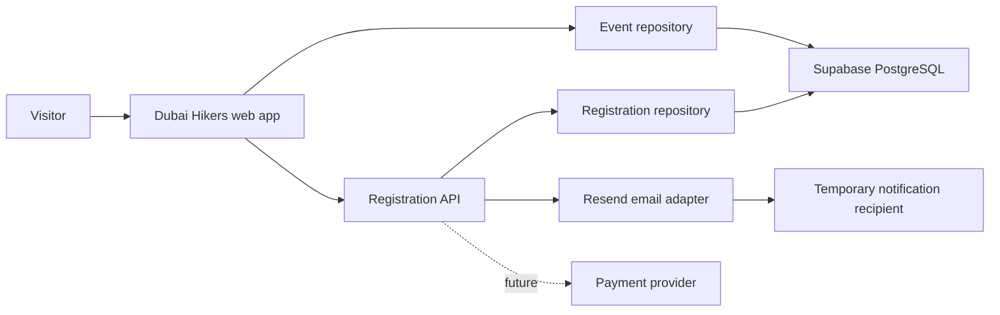
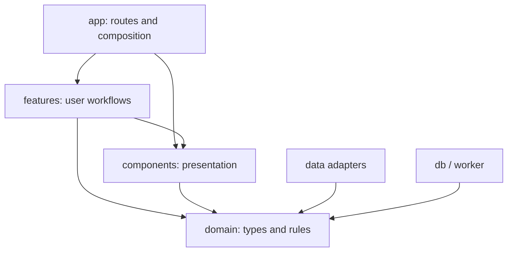
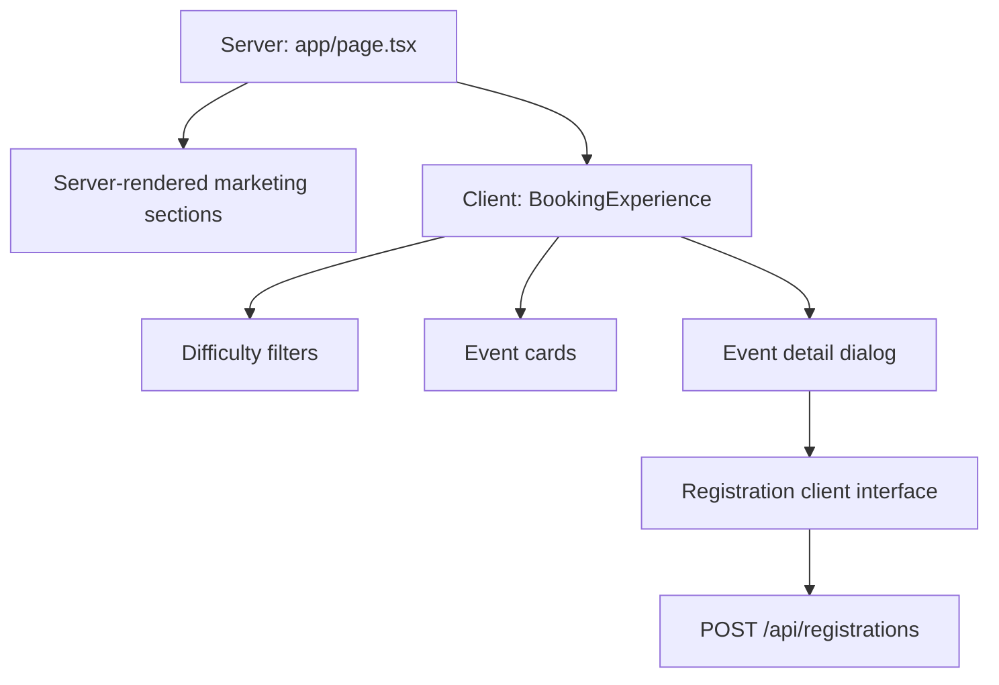
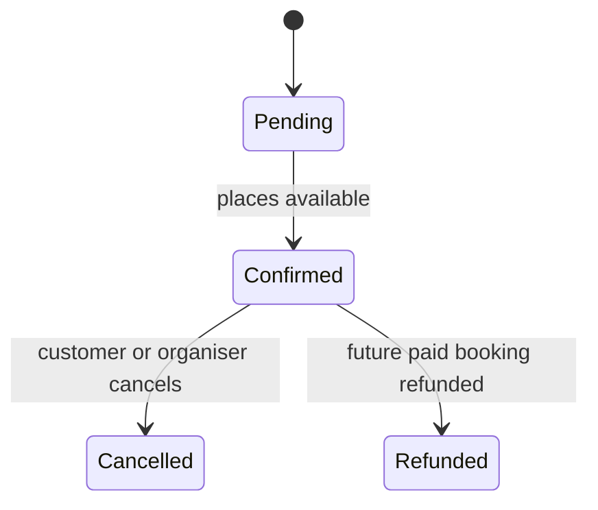
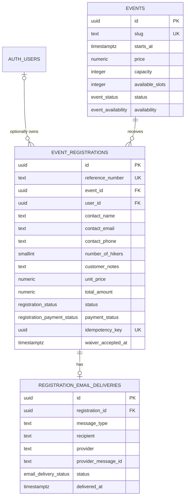

# Dubai Hikers Web Architecture

## 1. Goals

The architecture is designed to keep the current site simple while allowing the event discovery and booking product to grow without rewriting the presentation layer.

Primary goals:

- Keep static content server-rendered.
- Ship client JavaScript only for interactive workflows.
- Keep domain rules independent from React components.
- Make components reusable through typed props and callbacks.
- Keep data sources replaceable.
- Isolate infrastructure and deployment concerns.
- Preserve accessible keyboard, screen-reader, responsive, and reduced-motion behavior.
- Add abstractions only where a real boundary exists.

Scalability is not a fixed percentage or a guarantee. It must be validated against real traffic, data volume, availability, security, and business requirements. This document defines the boundaries intended to support that evolution.

## 2. System context



The current release implements dynamic event discovery and event registration through Supabase. The registration domain is isolated in `@dubaihikers/registrations`; the UI submits through a replaceable client interface and never imports Supabase. Payment remains an explicit future extension point.

## 3. Source structure

```text
apps/web/
├── app/
│   ├── api/
│   │   └── registrations/route.ts
│   ├── layout.tsx
│   ├── page.tsx
│   └── globals.css
├── components/
│   ├── ui/
│   │   ├── SectionHeading.tsx
│   │   └── useDialogAccessibility.ts
│   ├── EventCard.tsx
│   ├── EventModal.tsx
│   └── marketing sections
├── domain/
│   └── events/
│       ├── types.ts
│       └── formatters.ts
├── features/
│   └── booking/
│       ├── BookingExperience.tsx
│       ├── RegistrationForm.tsx
│       ├── RegistrationConfirmation.tsx
│       ├── registrationClient.ts
│       └── useRegistration.ts
├── data/
│   └── events.ts
├── utils/
│   └── supabase/
│       ├── server.ts
│       └── admin.ts
└── tests/
    └── rendered-html.test.mjs

packages/
├── events/
│   ├── src/
│   └── tests/
├── registrations/
    ├── src/
    └── tests/
└── notifications/
    ├── src/
    └── tests/

supabase/
├── migrations/
├── scripts/
└── seed/
```

## 4. Dependency rules

Dependencies should point inward toward stable concepts:



Rules:

1. `domain` must not import React, route, CSS, database, or worker code.
2. `components/ui` must not import booking state or static event data.
3. Feature components may coordinate state but must pass data through explicit props.
4. Routes compose features and server-rendered content; routes should not contain domain calculations.
5. Data adapters implement domain-shaped data. UI components must not know whether events came from a static file, database, or CMS.
6. Infrastructure must not be imported into client components.

These rules prevent circular dependencies and make individual layers replaceable.

## 5. Server and client rendering

`app/page.tsx` is a server component. It reads published events through the standalone repository package and passes serialized, typed event data into the booking feature.

`features/booking/BookingExperience.tsx` is the client boundary. It owns only:

- Difficulty filter state
- Selected event state



This keeps the static page available in the first server response while limiting hydration to the interactive experience.

## 6. Domain model

`packages/events/src/types.ts` owns the persisted event domain. `packages/registrations/src/types.ts` owns the registration request and receipt contracts. `packages/notifications` owns provider-independent email contracts, the Resend adapter, delivery persistence, orchestration, and templates. The web app owns only environment-based notification composition. `domain/events/types.ts` owns the web presentation shape:

- `Difficulty`
- `TrailEvent`

`domain/events/formatters.ts` owns locale-sensitive presentation rules such as AED currency and event-date formatting. Components do not parse display strings or manually concatenate currency values.

The current `displayDate` field is retained for data compatibility but new UI code formats the normalized ISO `date`. It can be removed after all external data sources stop supplying it.

## 7. Component design

Components follow these contracts:

- Data arrives through typed props.
- User intent leaves through callbacks.
- Components do not import the event catalogue.
- Components do not access booking state outside their feature.
- Repeated visual patterns become primitives only after they have a clear shared contract.

Examples:

- `EventCard` renders a `TrailEvent` and emits `onSelect(event)`.
- `EventModal` renders event details and coordinates the details, form, and confirmation steps.
- `RegistrationForm` owns registration fields and form-value extraction.
- `useRegistration` owns submission state, idempotency, API errors, and the injected `RegistrationClient`.
- `RegistrationConfirmation` renders the successful receipt.
- `HttpRegistrationClient` implements the browser-to-API transport without exposing Supabase to the component.
- `SectionHeading` provides a shared section-heading structure.
- `useDialogAccessibility` provides Escape handling, focus containment, initial focus, and focus restoration for modal surfaces.

## 8. Styling and design system

The visual system is centralized in `app/globals.css` because the site is currently a single branded surface. It contains:

- Color tokens as CSS custom properties
- Global element normalization
- Shared typography
- Component class contracts
- Fluid spacing and type tokens, container queries, and standard 640px, 768px, and 1024px breakpoints
- Visible focus states
- Reduced-motion behavior

As additional routes or independent product areas appear, styles should be moved beside the owning feature using CSS Modules. Global CSS should then retain only tokens, resets, typography, and truly shared utilities.

The event catalogue uses mobile-first responsive contracts: one column on small screens, two on tablet, and three on wide screens. Card internals adapt with a container query. Controls preserve a 44px minimum target, display type uses bounded `clamp()` scales, metadata remains readable, and system dark mode uses the same semantic color family.

Event titles and major display typography use fluid sizing. Images use `next/image`, responsive `sizes`, fixed aspect ratios, and an allow-listed remote host.

## 9. Accessibility

The application currently includes:

- Semantic sections, navigation, articles, forms, and headings
- Accessible names for icon-only actions
- `aria-pressed` for difficulty filters
- A polite live region for filtered result count
- Modal labelling and `aria-modal`
- Escape-key closing
- Focus containment and restoration
- Visible keyboard focus
- Reduced-motion support

Future automated coverage should add axe-based checks and browser tests for focus order, menu behavior, dialog containment, and form errors.

## 10. Data-source evolution

The current adapter is `data/events.ts`, backed by the `@dubaihikers/events` repository contract. Replacing Supabase should not require changing cards, dialogs, formatters, or booking UI.

Registration persistence follows the same boundary. The API depends on `@dubaihikers/registrations`, while the modal depends only on the `RegistrationClient` interface.

Recommended progression:

```text
Server-side event repository
    ↓
Supabase adapter
    ↓
Cached event queries and administrative publishing
```

## 11. Registration architecture

The current no-payment flow creates a confirmed registration after the server atomically rechecks availability. Events without enough capacity are displayed as fully booked; the customer UI does not offer a waitlist.



Current server-side guarantees:

- Schema validation at the API boundary
- Transactional capacity updates
- Idempotency keys
- Authoritative price calculation
- Booking status persistence
- Structured error responses

Never trust client-provided prices, availability, totals, or payment status.

Payment-provider webhooks, rate limiting, audit logging, and confirmation delivery remain future production concerns.

The current registration route sends a minimal booking-reference email once after persistence succeeds. Reusable notification contracts, provider adapters, persistence, orchestration, and standalone templates live in `@dubaihikers/notifications`; the web app supplies runtime configuration. A Next.js `after()` task performs the send after the registration response is returned and records the final result as `delivered` or `undelivered` in `registration_email_deliveries`. There is no queue or automatic retry; delivery failure does not roll back or hide a successful registration.

## 12. Persistence model



Database migrations should be generated and reviewed whenever the schema changes. Personally identifiable information should be minimized and protected according to the applicable UAE requirements and payment-provider responsibilities.

## 13. Testing strategy

Current automated checks verify:

- Event repository behavior
- Registration validation and normalization
- Registration repository mapping and safe errors
- Production build output
- Server-rendered product metadata and content
- Primary CTA presence
- Removal of starter content
- Server/client boundary preservation
- Domain type boundary presence
- Accessible dialog behavior contracts

Recommended next layers:

1. Unit tests for formatters and registration status transitions.
2. React interaction tests for filters and registration form states.
3. Browser tests for navigation, modal focus, registration, and responsive behavior.
4. API contract tests when backend endpoints exist.
5. Integration tests for inventory and payment webhooks.
6. Performance budgets for JavaScript, images, and Core Web Vitals.

## 14. Operational scalability

Code organization alone does not guarantee operational scalability. Before significant traffic, define and measure:

- Request latency and error-rate objectives
- Cache behavior and invalidation
- Database query limits and indexes
- Inventory contention
- Payment webhook reliability
- Observability and alerting
- Backup and recovery procedures
- Deployment rollback
- Security review and dependency updates

Cloudflare-compatible output provides a scalable runtime foundation, but the application must still be load-tested against expected booking peaks.

## 15. Definition of done

Changes are complete when:

- `pnpm lint` passes
- `pnpm test` passes
- `pnpm build` passes
- Server/client boundaries remain intentional
- New domain behavior has tests
- Keyboard and mobile behavior are preserved
- Documentation matches the implementation
- No production capability is claimed without an implemented backend
