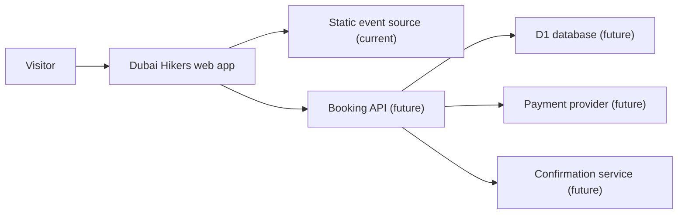
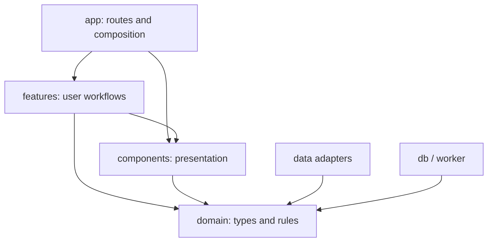
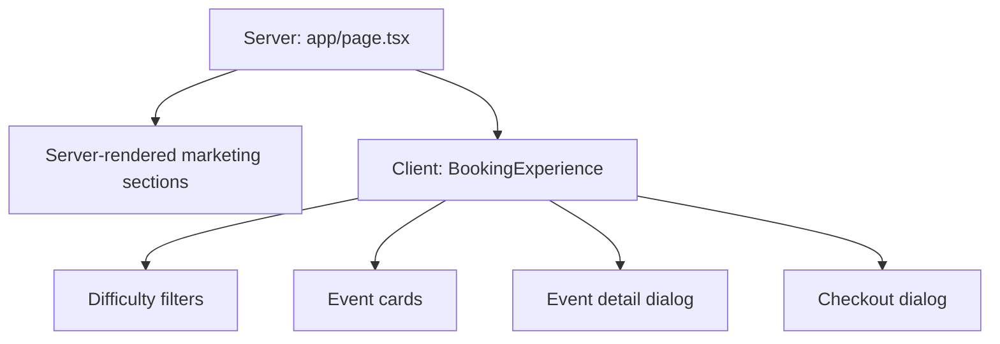
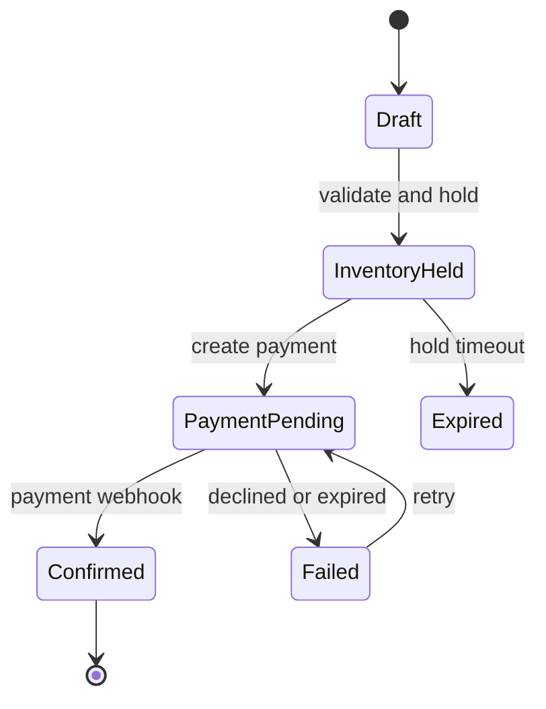

# Dubai Hikers Web Architecture

## 1. Goals

The architecture is designed to keep the current site simple while allowing the event discovery and booking product to grow without rewriting the presentation layer.

Primary goals:

- Keep static content server-rendered.
- Ship client JavaScript only for interactive workflows.
- Keep domain rules independent from React components.
- Make components reusable through typed props and callbacks.
- Keep data sources replaceable.
- Isolate infrastructure and deployment concerns.
- Preserve accessible keyboard, screen-reader, responsive, and reduced-motion behavior.
- Add abstractions only where a real boundary exists.

Scalability is not a fixed percentage or a guarantee. It must be validated against real traffic, data volume, availability, security, and business requirements. This document defines the boundaries intended to support that evolution.

## 2. System context



The current release implements discovery and a local prototype checkout. The future services are explicit extension points, not simulated production capabilities.

## 3. Source structure

```text
apps/web/
├── app/
│   ├── layout.tsx
│   ├── page.tsx
│   └── globals.css
├── components/
│   ├── ui/
│   │   ├── SectionHeading.tsx
│   │   └── useDialogAccessibility.ts
│   ├── EventCard.tsx
│   ├── EventModal.tsx
│   ├── CheckoutDrawer.tsx
│   └── marketing sections
├── domain/
│   └── events/
│       ├── types.ts
│       └── formatters.ts
├── features/
│   └── booking/
│       └── BookingExperience.tsx
├── data/
│   └── trails.ts
├── db/
│   ├── index.ts
│   └── schema.ts
├── worker/
│   └── index.ts
└── tests/
    └── rendered-html.test.mjs
```

## 4. Dependency rules

Dependencies should point inward toward stable concepts:



Rules:

1. `domain` must not import React, route, CSS, database, or worker code.
2. `components/ui` must not import booking state or static event data.
3. Feature components may coordinate state but must pass data through explicit props.
4. Routes compose features and server-rendered content; routes should not contain domain calculations.
5. Data adapters implement domain-shaped data. UI components must not know whether events came from a static file, database, or CMS.
6. Infrastructure must not be imported into client components.

These rules prevent circular dependencies and make individual layers replaceable.

## 5. Server and client rendering

`app/page.tsx` is a server component. It renders the marketing content and passes serialized, typed event data into the booking feature.

`features/booking/BookingExperience.tsx` is the client boundary. It owns only:

- Difficulty filter state
- Selected event state
- Current booking selection
- Checkout visibility



This keeps the static page available in the first server response while limiting hydration to the interactive experience.

## 6. Domain model

`domain/events/types.ts` owns the stable event and booking types:

- `Difficulty`
- `TrailEvent`
- `BookingItem`

`domain/events/formatters.ts` owns locale-sensitive presentation rules such as AED currency and event-date formatting. Components do not parse display strings or manually concatenate currency values.

The current `displayDate` field is retained for data compatibility but new UI code formats the normalized ISO `date`. It can be removed after all external data sources stop supplying it.

## 7. Component design

Components follow these contracts:

- Data arrives through typed props.
- User intent leaves through callbacks.
- Components do not import the event catalogue.
- Components do not access booking state outside their feature.
- Repeated visual patterns become primitives only after they have a clear shared contract.

Examples:

- `EventCard` renders a `TrailEvent` and emits `onSelect(event)`.
- `EventModal` renders event details and emits `onAdd(event, quantity)`.
- `CheckoutDrawer` renders a `BookingItem` and emits close/clear actions.
- `SectionHeading` provides a shared section-heading structure.
- `useDialogAccessibility` provides Escape handling, focus containment, initial focus, and focus restoration for modal surfaces.

## 8. Styling and design system

The visual system is centralized in `app/globals.css` because the site is currently a single branded surface. It contains:

- Color tokens as CSS custom properties
- Global element normalization
- Shared typography
- Component class contracts
- Fluid spacing and type tokens, container queries, and standard 640px, 768px, and 1024px breakpoints
- Visible focus states
- Reduced-motion behavior

As additional routes or independent product areas appear, styles should be moved beside the owning feature using CSS Modules. Global CSS should then retain only tokens, resets, typography, and truly shared utilities.

The event catalogue uses mobile-first responsive contracts: one column on small screens, two on tablet, and three on wide screens. Card internals adapt with a container query. Controls preserve a 44px minimum target, display type uses bounded `clamp()` scales, metadata remains readable, and system dark mode uses the same semantic color family.

Event titles and major display typography use fluid sizing. Images use `next/image`, responsive `sizes`, fixed aspect ratios, and an allow-listed remote host.

## 9. Accessibility

The application currently includes:

- Semantic sections, navigation, articles, forms, and headings
- Accessible names for icon-only actions
- `aria-pressed` for difficulty filters
- A polite live region for filtered result count
- Modal labelling and `aria-modal`
- Escape-key closing
- Focus containment and restoration
- Visible keyboard focus
- Reduced-motion support

Future automated coverage should add axe-based checks and browser tests for focus order, menu behavior, dialog containment, and form errors.

## 10. Data-source evolution

The current adapter is `data/trails.ts`. Replacing it should not require changing cards, dialogs, formatters, or booking UI.

Recommended progression:

```text
Static typed data
    ↓
Server-side event repository
    ↓
D1 or CMS adapter
    ↓
Cached event queries and administrative publishing
```

Introduce an `EventRepository` interface when a second data source or real persistence is added. Adding it before then would create abstraction without behavior.

## 11. Production booking architecture

The current checkout does not create a real booking. A production flow should use a server-controlled state machine:



Required server-side concerns:

- Schema validation at the API boundary
- Transactional inventory holds
- Idempotency keys
- Payment-provider webhooks
- Authoritative price calculation
- Booking status persistence
- Hold expiration
- Structured error responses
- Rate limiting and abuse protection
- Audit logging without sensitive-data leakage
- Email confirmation retries

Never trust client-provided prices, availability, totals, or payment status.

## 12. Persistence model roadmap

Suggested entities:

```text
events
event_occurrences
inventory_holds
bookings
booking_items
customers
payment_attempts
waiver_acceptances
```

Database migrations should be generated and reviewed whenever the schema changes. Personally identifiable information should be minimized and protected according to the applicable UAE requirements and payment-provider responsibilities.

## 13. Testing strategy

Current automated checks verify:

- Production build output
- Server-rendered product metadata and content
- Primary CTA presence
- Removal of starter content
- Server/client boundary preservation
- Domain type boundary presence
- Accessible dialog behavior contracts

Recommended next layers:

1. Unit tests for formatters and booking transitions.
2. React interaction tests for filters and quantities.
3. Browser tests for navigation, modal focus, checkout, and responsive behavior.
4. API contract tests when backend endpoints exist.
5. Integration tests for inventory and payment webhooks.
6. Performance budgets for JavaScript, images, and Core Web Vitals.

## 14. Operational scalability

Code organization alone does not guarantee operational scalability. Before significant traffic, define and measure:

- Request latency and error-rate objectives
- Cache behavior and invalidation
- Database query limits and indexes
- Inventory contention
- Payment webhook reliability
- Observability and alerting
- Backup and recovery procedures
- Deployment rollback
- Security review and dependency updates

Cloudflare-compatible output provides a scalable runtime foundation, but the application must still be load-tested against expected booking peaks.

## 15. Definition of done

Changes are complete when:

- `pnpm lint` passes
- `pnpm test` passes
- `pnpm build` passes
- Server/client boundaries remain intentional
- New domain behavior has tests
- Keyboard and mobile behavior are preserved
- Documentation matches the implementation
- No production capability is claimed without an implemented backend
