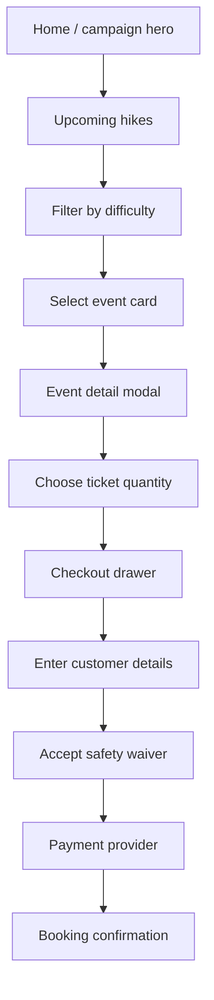

# User Interface Flow

## Discovery and Booking

## Event Detail

The event detail view should answer, without additional navigation:

- Where and when is the hike?
- How difficult is it?
- How long and far is the route?
- What is the elevation gain?
- What is included?
- What should the hiker bring?
- Where is the meeting point?
- How many spots remain?
- What is the full ticket price?

## Responsive Behaviour

### Mobile

- Compact header with menu and ticket count
- Single-column event catalogue
- Full-screen event details
- Full-width checkout drawer
- Large touch targets and sticky primary actions where appropriate

### Tablet

- Single or two-column catalogue based on available width
- Full-height modal with balanced media and content

### Desktop

- Two-column event catalogue
- Split image/content event modal
- Right-side checkout drawer

## UI States

Every data-driven surface should support:

- Loading
- Empty
- Error
- Available
- Low availability
- Sold out
- Cancelled
- Booking in progress
- Payment failed
- Booking confirmed
